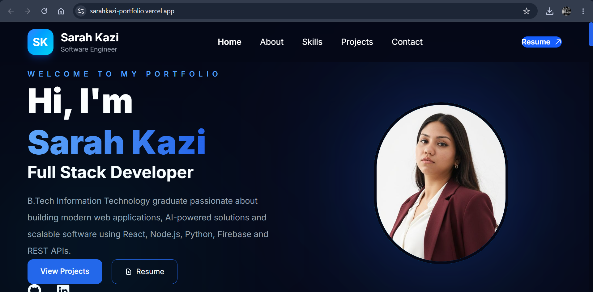

  

# 🌐 Sarah Kazi Portfolio

A modern, responsive developer portfolio built using React, Vite, Tailwind CSS, and Framer Motion. It showcases my projects, technical skills, certifications, and experience in software development.

## 🚀 Live Demo

🔗 https://sarahkazi-portfolio.vercel.app/

## ✨ Features

- Modern and responsive UI
- Smooth animations with Framer Motion
- Project showcase with live previews
- Skills section
- Certifications section
- Contact form powered by EmailJS
- Resume download
- Mobile-friendly design

## 🛠️ Tech Stack

- React
- Vite
- Tailwind CSS
- Framer Motion
- React Icons
- EmailJS

## 📂 Featured Projects

- 🌱 Growise
- 🤖 Ragify
- 🍱 SwaadExpress
- 💰 Finance Fellow
- 🎬 Netflix Clone
- 🎵 Music Recommendation System
- ✅ To-Do List

## 📬 Contact

📧 Email: sarahkazi889@gmail.com

💼 LinkedIn:
https://www.linkedin.com/in/sarah-kazi-8972a222a/

💻 GitHub:
https://github.com/Sarahkazi04

🌐 Portfolio:
https://sarahkazi-portfolio.vercel.app/

---

⭐ If you like this project, consider giving it a star!